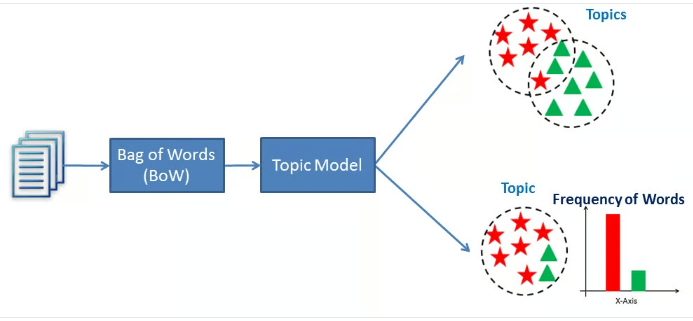

# Topic Modeling Using LDA (Latent Dirichlet Allocation)

*Image Source: [media.datacamp](https://media.datacamp.com/legacy/v1697708918/image_8ba024f31a.png)*

Topic Modeling is an essential technique in Natural Language Processing (NLP) used to uncover hidden themes or topics within a collection of text documents. This approach assigns topic labels to text by analyzing word patterns and frequencies, thereby revealing the underlying structure and relationships in the content.

The primary objective of topic modeling is to identify the key topics present in a large set of documents without requiring prior labeling. It is particularly useful for organizing, summarizing, and understanding vast amounts of unstructured text data.

In this project, I will be using LDA(Latent Dirichlet Allocation) for performing topic modeling.
This method analyze word distribution within the text corpus to determine the probability of each word belonging to a particular topic, allowing for the extraction of meaningful themes from the documents.

By applying topic modeling, we can effectively categorize and interpret text data, which is invaluable in various applications such as document clustering, information retrieval, recommendation systems, and sentiment analysis.

## Table of Contents

<ol>
<li><a href="#Datasets"><b> Datasets </a></b></li>
<li><a href="#EDA"><b> Exploratory Data Analysis </a></b></li>
<li><a href="#finalization"><b> Model Finalization </a></b></li>
<li><a href="#saveload"><b> Saving & Loading the Model </a></b></li>
<li><a href="#conclusion"><b> Conclusion </a></b></li>
</ol>

<h2 id="Datasets">1. Datasets</h2>

Here, I will be using a demo dataset for this project. It has two columns initially, called Article and their respective titles, but I will drop the titles column since we are creating a model to find these titles.

This `Article` column has many articles, which we will use to traind LDA and then set 5 topics. And all of these articles will be clustered in these 5 different articles.

