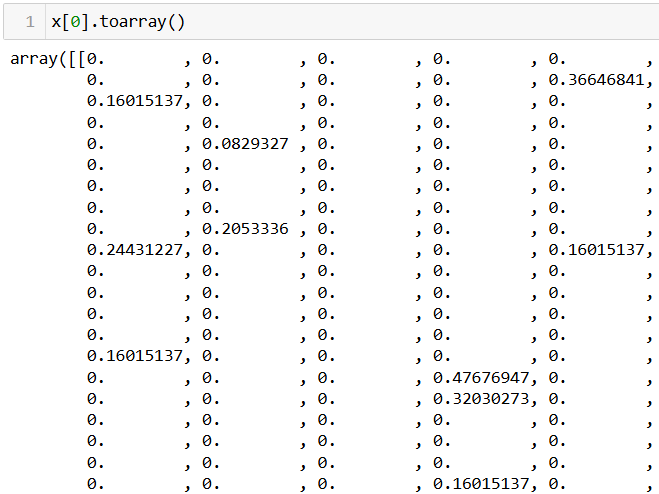
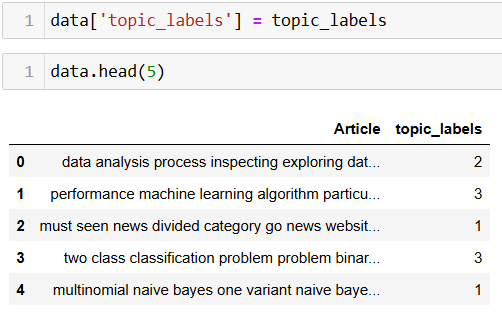
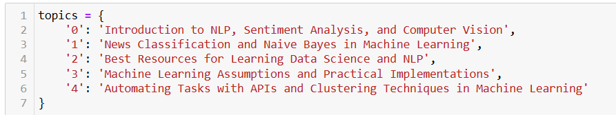
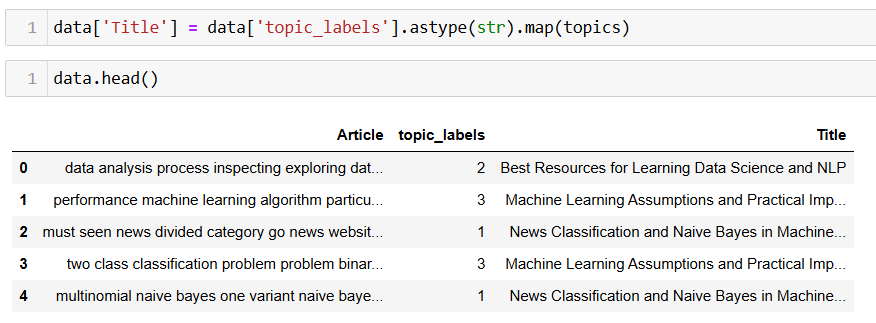
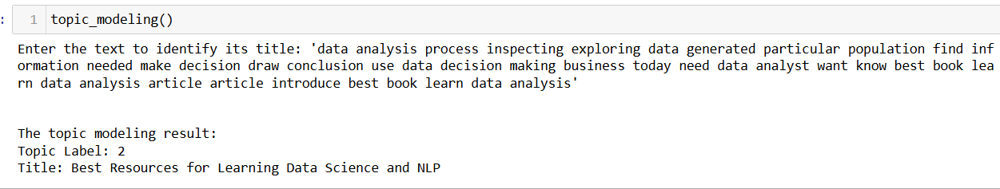

# Topic Modeling Using LDA (Latent Dirichlet Allocation)

*Image Source: [media.datacamp](https://media.datacamp.com/legacy/v1697708918/image_8ba024f31a.png)*

Topic Modeling is an essential technique in Natural Language Processing (NLP) used to uncover hidden themes or topics within a collection of text documents. This approach assigns topic labels to text by analyzing word patterns and frequencies, thereby revealing the underlying structure and relationships in the content.

The primary objective of topic modeling is to identify the key topics present in a large set of documents without requiring prior labeling. It is particularly useful for organizing, summarizing, and understanding vast amounts of unstructured text data.

In this project, I will be using LDA(Latent Dirichlet Allocation) for performing topic modeling.
This method analyze word distribution within the text corpus to determine the probability of each word belonging to a particular topic, allowing for the extraction of meaningful themes from the documents.

By applying topic modeling, we can effectively categorize and interpret text data, which is invaluable in various applications such as document clustering, information retrieval, recommendation systems, and sentiment analysis.

## Table of Contents

<ol>
<li><a href="#Datasets"><b> Datasets </a></b></li>
<li><a href="#DataCleaning"><b> Data Cleaning </a></b></li>
<li><a href="#vectorspace"><b> Vector Space </a></b></li>
<li><a href="#lda"><b> LDA(Latent-Dirichlet-Allocation) </a></b></li>
<li><a href="#implementation"><b> Implementation </a></b></li>
<li><a href="#conclusion"><b> Conclusion </a></b></li>
</ol>

<h2 id="Datasets">1. Datasets</h2>

Here, I will be using a demo dataset for this project. It has two columns initially, 
called `Article` and their respective `Titles`, but I will drop the `Titles` column since 
we are creating a model to find these `Titles`.

This `Article` column has many articles, which we will use to train
 `LDA` and then set 5 topics. And all of these articles will be clustered 
 in these 5 different articles.

**Initial dataset:**

**The dataset we will be using:**

In total there are 34 Articles in this dataset.

<h2 id="DataCleaning">2. Data Cleaning</h2>
When working with textual data, it is important to get rid of punctuations, stop words and 
to lemmatize (bringing the words to their root form) in order to remove complications and 
give the model a data in proper format for better learning.

So, I have created a function called `preprocess_text`, that will take in the data and returns
the pre-processed text.

I will be using `.apply()` method to implement this function row wise as below:

<h2 id="vectorspace">3. Vector Space</h2>

The textual data needs to be converted into a numerical format since the model cannot
directly work with the data if it is in text. So, in this step, once the data
has been pre-processed, I will use `TfidfVectorizer()`, in order to vectorize the data.

The vectorized data willl be in sparsematrix format because of the size and number of
zeroes in the vector, but to get an idea of how it looks like, here, below, we can
see how the sparse data at `index[0]` would look like if converted to an array, it is just
a part of the output:

<h2 id="lda">4. LDA(Latent-Dirichlet-Allocation)</h2>

Now, we have a vectorized pre-processed data, and will be using it to train `LDA`:

Here, I have defined the `n_components=5`, which we can change as per the need, in real-world, 
we need to have a conversation with the experts on the number of topics we want.

So, after training, we get a result in `(34, 5)` shape like this:

Here:

**- row (34):** It represents the number of Articles we had.

**- column (5):** These represent the number of topics we set when training the `LDA` and the
value are the probability of falling a particular documnent in a particular title.

Now, I will pull out the index values using `np.argmax()`, it will give us the index value 
which has the highest probability out of all and 
the resulting value (`topic_labels`) would look like below:

So, these are the 5 topics for each article, the values ranges from 0 to 4.

Adding the new column as the topic label in the existing data:

But the problem here is, these numeric values doesn't add any meaning, so as mentioned 
earlier, a proper discussion has to be held with the domain expert in order to defined 
how many topics we need and once we get these results, each of these values need to be 
assigned a topic comparing these Articles on 5 of these clusters.

So, I took help from ChatGPT for this and defined the topics as below:

And then mapped the titles with their respective topic labels:

<h2 id="implementation">5. Implementation</h2>

Now, we have our final model ready, so in the future, if someone wants to 
know the title or in which genre a particular Article falls into, they can
use this model to predict it.

For this, I created a function called `topic_modeling`, that would take an input
for the article from
the user, preprocess it, vectorize it and finally print out the 
**Topic label** and its **Title** like below:

<h2 id="conclusion">6. Conclusion</h2>

Topic modeling, especially with **Latent Dirichlet Allocation (LDA),**
is a powerful technique for uncovering hidden themes within large text corpora. 

It is widely used in various real-world applications, including:

- Document classification: Grouping similar documents based on identified topics.
- Recommender systems: Enhancing content recommendation by understanding user preferences.
- Sentiment analysis: Identifying dominant topics in user reviews or social media posts to gauge public opinion.
- Customer support: Categorizing support tickets or feedback to improve response efficiency.
- Research: Assisting in literature reviews by summarizing key topics from vast amounts of academic papers.

LDA enables businesses and researchers to gain insights from textual data, 
driving informed decision-making and personalized user experiences.

